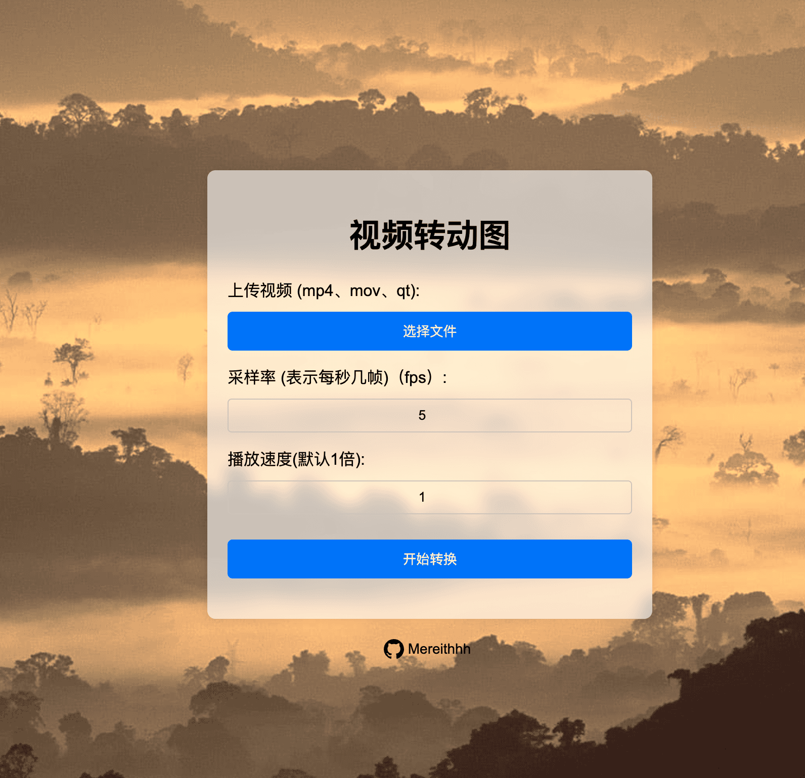

# voide2gif

在线视频转动图

> 有一天突然有了这个需求（做表情包），于是在 AI 的帮助下做了这么个玩意儿。   
> 于是我就可以： 手机拍视频 -> 手机浏览器打开网站 -> 做一个动图发微信  

> 其实还有一个纯前端的 wasm 版本，但是加载 ffmpeg 的 wasm 速度太慢了，就改成后端转码了。 - -
> 从源码可以看到，这个程序不会保存任何信息，转换完就删掉了，不放心的话可以自己部署一套。

[在线使用](https://video2gif.mereith.com)



## 自己部署
```shell
docker run -d --name video2gif --restart always -p 3000:3000 docker.io/mereith/video2gif
```

然后打开 `http://<ip>:3000` 即可